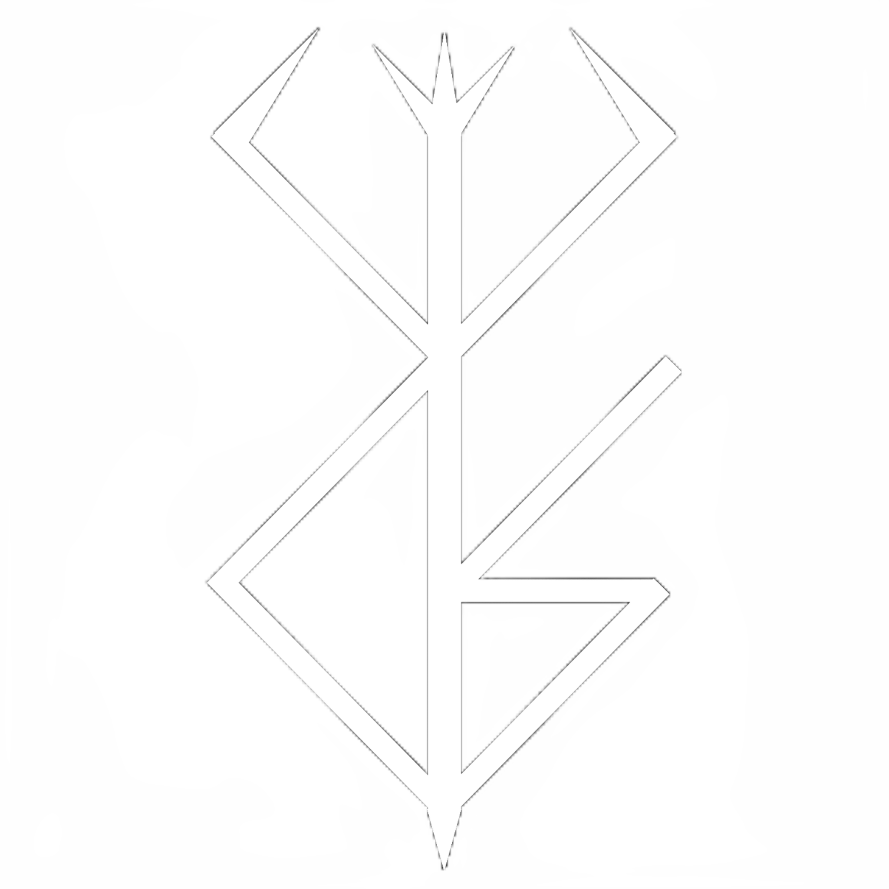
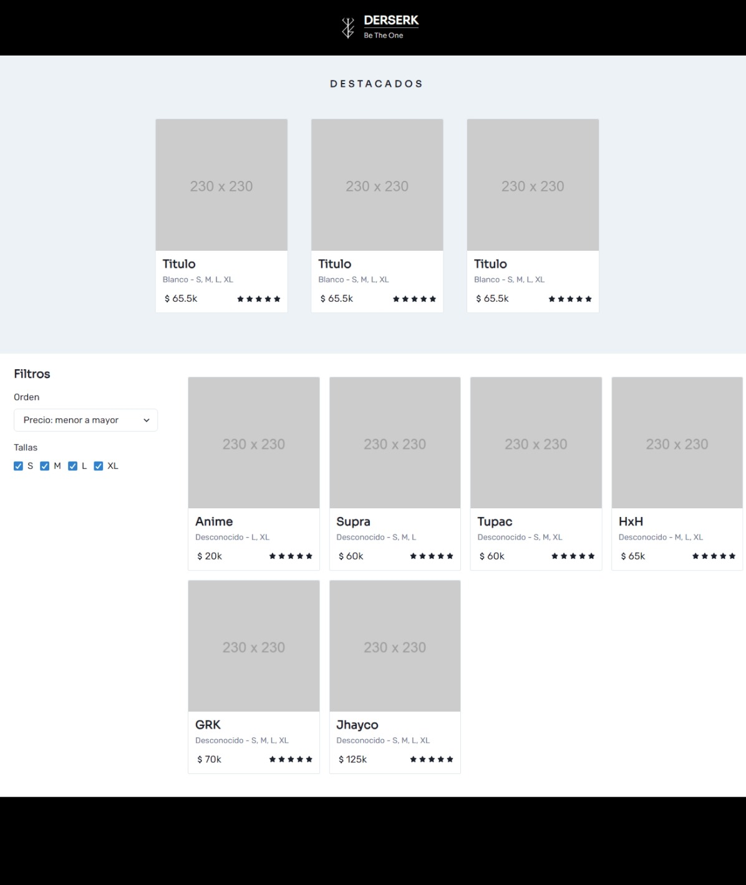

    

<h1 align="center">Derserk - Shop</h1>

> [!NOTE]
> Esta página fue desarrollada en el contexto de trabajo freelancer. Este repositorio es una muestra de mi experiencia laboral.

### Caracteristicas

-   [x] Opciones para filtrar y ordenar la lista de productos
-   [x] Muestra los datos básicos del producto
-   [x] Contacto vía WhatsApp con el dueño
-   [ ] Métodos de pago en la página

### Desarrollado con

	<table>
		<tr>
			<td><code></code></td>
			<td><code></code></td>
		</tr>
	</table>

### Screenshots

> ### Visitar página: https://derserk-shop.onrender.com
